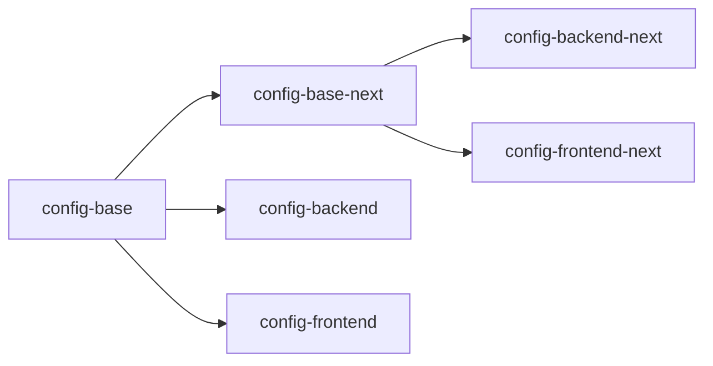

# eslint-config-neo

Official Neo Financial ESLint configuration

## Available Configs

This package includes 4 different ESLint configs:

- `config-backend`
- `config-frontend`
- `config-backend-next`
- `config-frontend-next`

The `next` versions include some rules that are being considered for inclusion in future versions of the base config. The `next` configs also require you to specify the `project` setting in `parserOptions` for TypeScript projects. The will make ESLint run slower in TypeScript projects.

## Relationships Between Configs



The arrows from left to right illustrate which configs are extended by another config.

## Installation

### Install Package

`npm install --save-dev eslint-config-neo`

You can also install a specific version of the package by appending the version tag. For example, to install version `1.0.0`

`npm install --save-dev eslint-config-neo@1.0.0`

### Install Peer Dependencies

```sh
npm install -D eslint prettier lint-staged husky typescript
```

### Make ESLint Config File

Add `.eslintrc` to project root

```json
{
  "extends": "eslint-config-neo/config-backend"
}
```

_Use `eslint-config-neo/config-frontend` for frontend projects_

### Optional: Configure `parserOptions` with `next` configs

If you're using one of the `next` configs you must set the `project` option to include _all_ of your `tsconfig.json` files:

```json
{
  "extends": "eslint-config-neo/config-backend",
  "parserOptions": {
    "project": ["tsconfig.json", "test/tsconfig.json"]
  }
}
```

### Make Prettier Config File

Add `.prettierrc` to project root

```json
{
  "printWidth": 120,
  "singleQuote": true
}
```

Optional: If there are any files you want to exclude from Prettier add `.prettierignore` to project root

### Make Editorconfig File

Add `.editorconfig` to project root

```ini
# http://editorconfig.org
root = true

[*]
charset = utf-8
end_of_line = lf
indent_size = 2
indent_style = space
insert_final_newline = true
max_line_length = 120

[*.md]
max_line_length = 0
trim_trailing_whitespace = false

[COMMIT_EDITMSG]
max_line_length = 0
```

### Add Engines

Add the engines field to `package.json`

```json
"engines": {
  "node": "^12.0.0"
}
```

### Add Scripts

Add scripts for linting and formatting to `package.json`

```json
"scripts": {
  "lint": "eslint .",
  "format": "prettier --write \"**/*.{ts,tsx,js,json,graphql,md}\"",
  "format:check": "prettier --debug-check \"**/*.{ts,tsx,js,json,graphql,md}\""
}
```

### Add Precommit Hook

Add a precommit hook to `package.json` to automatically lint and format any files staged for commit

```json
"husky": {
  "hooks": {
    "pre-commit": "lint-staged"
  }
},
"lint-staged": {
  "concurrent": false,
  "linters": {
    "*.{ts,tsx,js}": [
      "eslint --quiet",
      "git add"
    ],
    "*.{ts,tsx,js,json,graphql,md}": [
      "prettier --write",
      "git add"
    ]
  }
}
```

### Format Code

If you've added Prettier to an existing project you will want to format all the code. The precommit hook only updates files that have been changed and staged for commit. To format the entire codebase run

`npm run format`

## Upgrading to version 7

- `npm install -D eslint@latest eslint-config-neo@latest`
- for backend services, delete the domain-specific `eslintrc`

## FAQ

**Should I override the rule X? I don't like it.**

No. If you want to do this, you have to ask the team. If a rule really doesn't make sense then we should remove or disable it.

**Can I disable the rule on one line in my code, I have a good reason.**

Yes. That's ok. Use a single-line disable.

## Publishing

### For Release

1. Update the version in `package.json`
1. Create a `CHANGELOG` entry
1. Commit your changes
1. `npm pack --dry-run` to see what will be published
1. `npm publish`
1. Create a release on GitHub. Use the version as the tag and release name. For example for version `1.0.0` the tag and release name would be `v1.0.0`. Add the `CHANGELOG` details to the release.

### For Development

1. Update the version in `package.json` to be postfixed with `-next.x` where `x` is a number

- for example your first test version might look like `0.7.1-next.0`, second test version would have `next.1`, etc

2. run `npm publish --canary --exact --preid canary --tag=canary`
3. In the project you wish to test in, run `npm i eslint-config-neo@canary`
