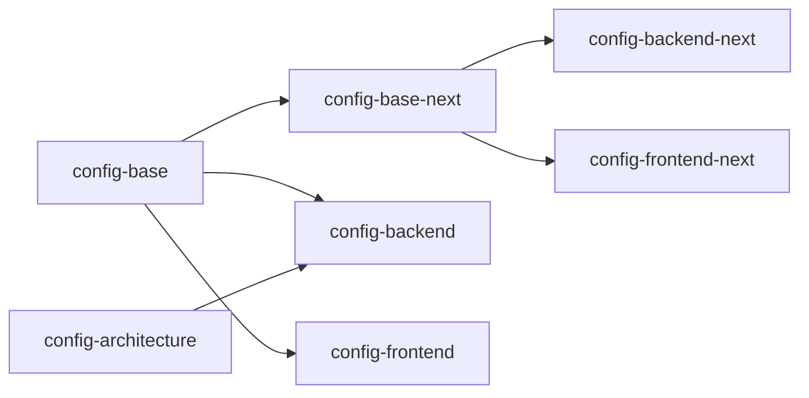

# eslint-config-neo

Official Neo Financial ESLint configuration

## Available Configs

This package includes 5 different ESLint configs:

- `config-backend`
- `config-frontend`
- `config-backend-next`
- `config-frontend-next`
- `config-architecture`

The `next` versions include some rules that are being considered for inclusion in future versions of the base config. The `next` configs also require you to specify the `project` setting in `parserOptions` for TypeScript projects. The will make ESLint run slower in TypeScript projects.

### config-architecture (for Biome users)

The `config-architecture` is designed for services that have migrated to **Biome.js** for linting and formatting. It contains ONLY the hexagonal architecture enforcement rules that Biome cannot provide:

- `import/no-restricted-paths` - Enforces layer boundaries (domain, application, infrastructure)
- `@typescript-eslint/no-restricted-imports` - Enforces lodash tree-shaking and domain isolation

Use this config alongside Biome to maintain architecture enforcement while benefiting from Biome's speed.

## Relationships Between Configs


```mermaid
flowchart LR
    A[config-base]
    B[config-base-next]
    C[config-backend]
    D[config-frontend]
    E[config-backend-next]
    F[config-frontend-next]
    G[config-architecture]
    A --> C
    G --> C
    A --> D
    A --> B
    B --> E
    B --> F
```

The arrows from left to right illustrate which configs are extended by another config.

- `config-backend` extends both `config-base` and `config-architecture`
- `config-architecture` is also available standalone for Biome users who only need hexagonal architecture enforcement

## Installation

### Install Package

`npm install --save-dev eslint-config-neo`

You can also install a specific version of the package by appending the version tag. For example, to install version `1.0.0`

`npm install --save-dev eslint-config-neo@1.0.0`

### Install Peer Dependencies

```sh
npm install -D eslint prettier lint-staged husky typescript
```

### Make ESLint Config File

Add `.eslintrc` to project root

```json
{
  "extends": "eslint-config-neo/config-backend"
}
```

_Use `eslint-config-neo/config-frontend` for frontend projects_

### Optional: Configure `parserOptions` with `next` configs

If you're using one of the `next` configs you must set the `project` option to include _all_ of your `tsconfig.json` files:

```json
{
  "extends": "eslint-config-neo/config-backend",
  "parserOptions": {
    "project": ["tsconfig.json", "test/tsconfig.json"]
  }
}
```

### Make Prettier Config File

Add `.prettierrc` to project root

```json
{
  "printWidth": 120,
  "singleQuote": true
}
```

Optional: If there are any files you want to exclude from Prettier add `.prettierignore` to project root

### Make Editorconfig File

Add `.editorconfig` to project root

```ini
# http://editorconfig.org
root = true

[*]
charset = utf-8
end_of_line = lf
indent_size = 2
indent_style = space
insert_final_newline = true
max_line_length = 120

[*.md]
max_line_length = 0
trim_trailing_whitespace = false

[COMMIT_EDITMSG]
max_line_length = 0
```

### Add Engines

Add the engines field to `package.json`

```json
"engines": {
  "node": "^12.0.0"
}
```

### Add Scripts

Add scripts for linting and formatting to `package.json`

```json
"scripts": {
  "lint": "eslint .",
  "format": "prettier --write \"**/*.{ts,tsx,js,json,graphql,md}\"",
  "format:check": "prettier --debug-check \"**/*.{ts,tsx,js,json,graphql,md}\""
}
```

### Add Precommit Hook

Add a precommit hook to `package.json` to automatically lint and format any files staged for commit

```json
"husky": {
  "hooks": {
    "pre-commit": "lint-staged"
  }
},
"lint-staged": {
  "concurrent": false,
  "linters": {
    "*.{ts,tsx,js}": [
      "eslint --quiet",
      "git add"
    ],
    "*.{ts,tsx,js,json,graphql,md}": [
      "prettier --write",
      "git add"
    ]
  }
}
```

### Format Code

If you've added Prettier to an existing project you will want to format all the code. The precommit hook only updates files that have been changed and staged for commit. To format the entire codebase run

`npm run format`

## On Upgrading to version 7 or higher

- requires `eslint` version `8.26.0` or higher
- for backend services, you should delete the domain-specific `eslintrc`

## FAQ

**Should I override the rule X? I don't like it.**

No. If you want to do this, you have to ask the team. If a rule really doesn't make sense then we should remove or disable it.

**Can I disable the rule on one line in my code, I have a good reason.**

Yes. That's ok. Use a single-line disable.

## Publishing

### Alpha versions

Sometimes, testing functionality locally using symlinks can be challenging.
In such cases, publishing an alpha version for use in other environments can be a practical way to test new changes.

1. Make sure the version in `package.json` is following this format: `<<major>>.<<minor>>.<<patch>>-alpha.<<alpha version>>` (e.g. `1.2.5-alpha.0`, `1.2.5-alpha.1`, etc).
1. Make sure all changes including the version bump, lock file and your library changes are committed and pushed to your feature branch.
1. Run `npm publish --tag alpha` (To be able to publish the new NPM package the user should be included on the [NPM Publisher List](https://www.npmjs.com/settings/neofinancial/teams/team/publishers/users). If you're not on that list ask for help to publish.)

### Beta versions (Release candidate)

On some rare situations we need to test Library changes versions on a few services in Production, before rolling out this change to all services that uses the library. How it works:

1. Make sure the version in `package.json` is following this format: `<<major>>.<<minor>>.<<patch>>-beta.<<beta version>>` (e.g. `1.2.5-beta.0`, `1.2.5-beta.1`, etc).
1. Make sure all changes including the version bump, lock file and your library changes are committed and pushed to your feature branch.
1. Open a Pull Request targeting the merge to a branch that matches with the following pattern: "\**/*release-candidate\*"
1. After getting approvals, merge your changes into the Release Candidate branch;
1. Run `npm publish --tag beta` (To be able to publish the new NPM package the user should be included on the [NPM Publisher List](https://www.npmjs.com/settings/neofinancial/teams/team/publishers/users). If you're not on that list ask for help to publish.)

### Stable versions

Once your changes have being tested and you're ready to publish a stable version, open your Pull Request, get approvals, merge it and publish the new package version. How it works:

1. Make sure the version in `package.json` is following this format: `<<major>>.<<minor>>.<<patch>>` (e.g. `1.2.5`, `1.3.0`, etc).
1. Make sure all changes including the version bump, lock file and your library changes are committed and pushed to your feature branch.
1. Pull request is approved and merged into `master` branch;
1. Run `npm publish --tag stable` (To be able to publish the new NPM package the user should be included on the [NPM Publisher List](https://www.npmjs.com/settings/neofinancial/teams/team/publishers/users). If you're not on that list ask for help to publish.)
